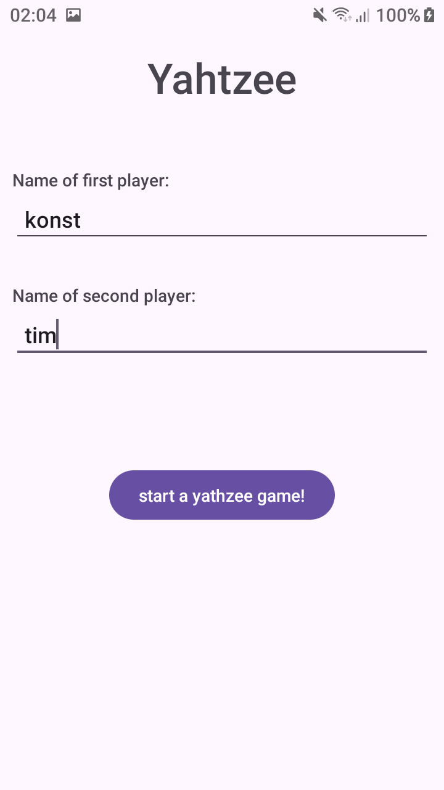
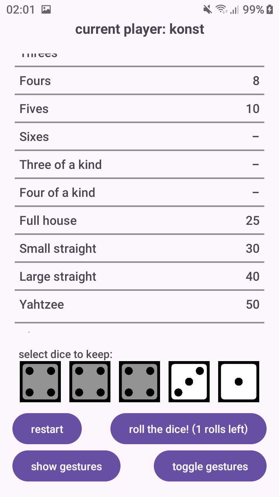
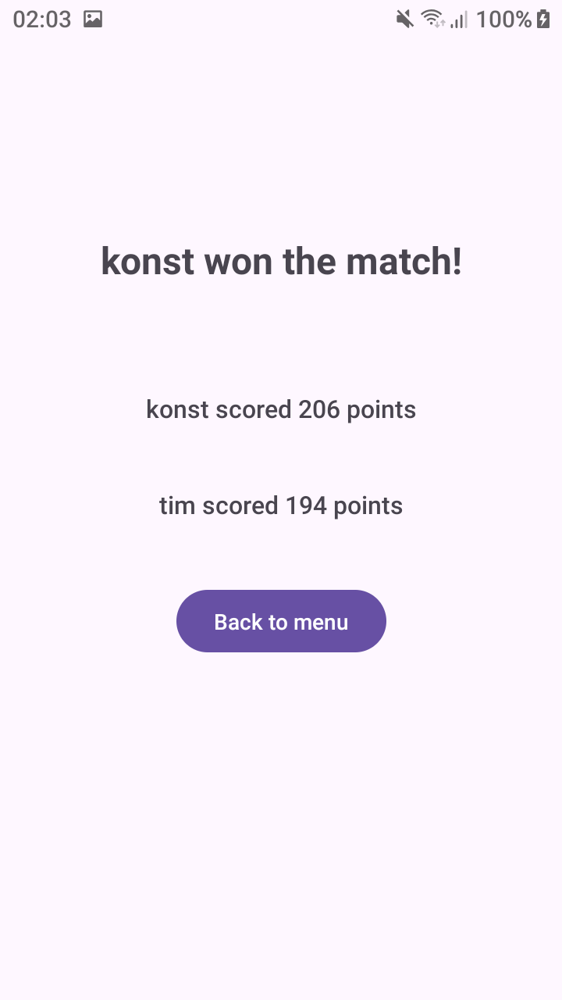
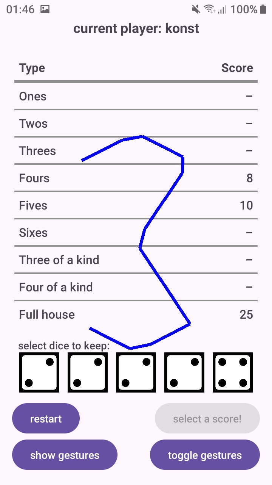

# Android Yahtzee
multimodal android app consisting of a [yahtzee](https://en.wikipedia.org/wiki/Yahtzee) clone developed using android studio in java. a major difference to the original version is that there are no bonuses. the app can be used via touch, voice, gesture and any combination of those methods. software contains code licensed under [bsd-3](https://opensource.org/license/bsd-3-clause), [apache 2.0](https://www.apache.org/licenses/LICENSE-2.0) and [mit](https://opensource.org/license/mit).

| main menu | in game | score |
|-----------|---------|-------|
|  |   |  |

## Voice interaction
the app uses a [custom alexa skill](https://developer.amazon.com/en-US/docs/alexa/custom-skills/steps-to-build-a-custom-skill.html) for the voice interaction. the backend for the alexa skill (lambda function) is a nodejs server which sends https requests to the server handling the voice interactions. the address of the server handling the interactions can be configured in variable `extApi`. the skill can be found in `./alexaskill`.
the app starts a webserver on port `8080` using [nanohttpd](https://github.com/NanoHttpd/nanohttpd) to handle https requests. the app can be used via voice interface only, help systems exist. a dialog might look like this:

> **User**: start special dice game
>
> **Alexa**: welcome to yathzee. two players can play against each other. you can now specify the names of the players and start the game. just say 'help' anytime and i will list available voice commands. whats the name of the first player?
>
> **User**: first player is john
>
> **Alexa**: ok. whats the name of the second player?
>
> **User**: tim
>
> **Alexa**: alright john and tim, get prepared. john, its your turn! rolling dice... rolled 4, 4, 2, 3 and 5. would you like to know your remaining scores?
> 
> **User**: help
>
> **Alexa**: say 'start', to start a new yathzee game with the registered game configurations. say 'take dice with number' followed by dice numbers, to take the dice with the given numbers. for example: 'take dice with number 1 and 2'. ...
>
> **User**: take dice with number 4.
>
> **Alexa**: keeping the 4.
> 
> **User**: roll the dice.
>
> **Alexa**: rerolling 3 dice... rolled 5, 4 and 1. john, your current dice are 4, 4, 5, 4 and 1. keeping the first and second die and you have 1 rolls left. would you like to know your remaining scores?
>
> **User**: yes
> 
> **Alexa**: you still need the ones, twos, ... . would you like to hear your dice again?
>
> **User**: release the first, second and forth die.
>
> **Alexa**: no longer keeping the first, second and forth die. would you like to hear your dice again?
>
> **User**: roll the dice.
>
> **Alexa**: rerolling 5 dice... rolled 3, 4, 2, 5 and 1. john, your current dice are 3, 4, 2, 5 and 1. keeping no die and you have no rolls left. would you like to hear your dice again?
>
> **User**: whats small straight?
>
> **Alexa**: a small straight consists of 4 sequential dice numbers. if thats the case, you can get 30 points. for example, small straight for 2,3,4,5,3 is 30.
>
> **User**: score for large straight?
>
> **Alexa**: score for large straight is 40.
>
> **User**: score as large straight.
> 
> **Alexa**: alright, scored 40 points for large straight. tim, its your turn! ...

## Gesture interaction

  
drawing a specific path with the finger on the touchpad can trigger actions as well. gestures need to be enabled with the bottom right button by hitting it once (twice would disable it again). to see available gestures, the button in the bottom left can be used. depending on the game state, actions can be interpreted in different ways. drawing a number without a given context is interpreted as checking the score for one of the numerical score. the cube-shape is always interpreted as rolling the dice or scoring. the implementation uses <a href ="https://github.com/rmaestre/FastDTW">fastdtw</a> for comparing paths.

  

## Combined interaction
there are some special commands which contain slots which can be filled in multiple ways. for example the voice command "reroll" triggers the special command for rerolling certain dice. after the start command, fitting touch/voice or gesture commands will be interpreted to fill the slots. in the case of the reroll command, pressing the die/drawing or saying its positional number will mark them as to be rerolled instead of being kept. after the last command, the special command will be executed. theres a timeout of `10s` for filling in slots of a triggered special command. special commands:
- *rerolling specific dice only*: (voice)"reroll";dice positions;roll action triggered e.g. (voice) "dice" or pressing the button for rerolling
- *scoring*: (voice)"score as";score name
- *closing the game*: (voice)"end";(voice)"the game"
